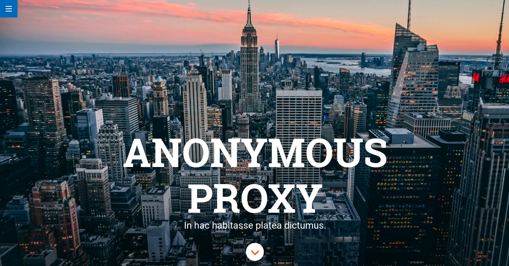

# Prueba técnica de Adalab.
Interfaz diseñada para la prueba técnica de Adalab, en la que se usa SCSS, un sistema de plantillas HTMl y un web server. Además, se ha incluido el uso de landmarks para mejorar la accesibilidad.

## Guía para usar el repositorio
Necesitarás instalar [Node.js](https://nodejs.org/) y [Gulp](https://gulpjs.com) para trabajar con este repositorio, luego:
1. Descarga o clona el repositorio.
2. Instala las dependencias locales con `npm install`para instalar los paquetes necesarios para convertir Sass a CSS, minizarlo, etc.
3. Arranca el kit con `gulp`

> ### Cada vez que trabajemos con el código:
- Desde nuestra terminal, ejecutamos el comando `gulp` para que realice la tarea por defecto. El `gulpfile.js` estará pendiente de nuestros archivos Sass, html y JavaScript y los compilará, minificará y/o recargará el servidor cada vez que hagamos un cambio.

## Tareas de gulp incluidas
### Inicio de un web server para desarrollo
```
npm start
```
o lo que en este proyecto es lo mismo:

```
gulp
```
Lanza un webserver con BrowserSync y varios watchers estarán pendientes de los archivos SCSS/JS/HTML, en la carpeta **public/**, para recargar el navegador cuando se necesite.

### Versión lista para subir a producción

Para generar los ficheros para producción ejecuta:

```
npm run docs
```
o lo que en este proyecto es lo mismo:
```
gulp docs
```
En la carpeta **docs/** se generarán los CSS y JS minimizados y sin sourcemaps listos para subir al repo. A continuación súbelos al repo y activa en GitHub Pages la opción **master/docs/**, para que GitHub Pages sirva la página desde la carpeta **docs/**.

---

Si quieres generar los ficheros listos para producción y además subirlos a GitHub directamente ejecuta el siguiente comando:
```
npm run push-docs
```
Este comando borra la carpeta **docs/**, la vuelve a generar, crea un commit con los nuevos ficheros y hace un `git push.
